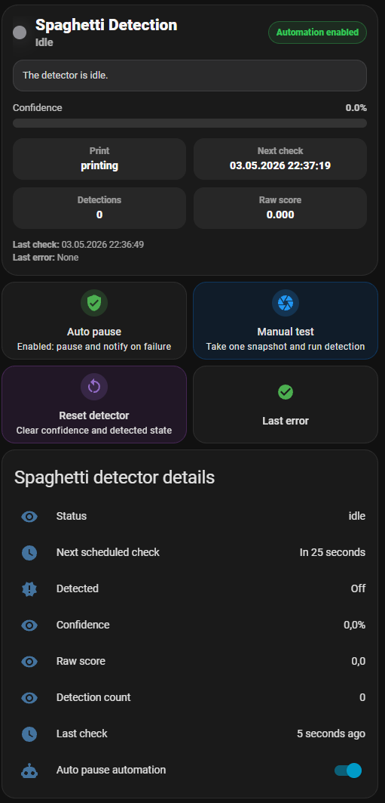
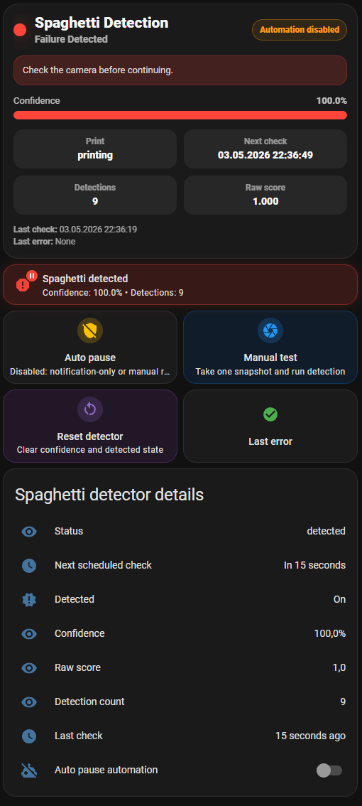
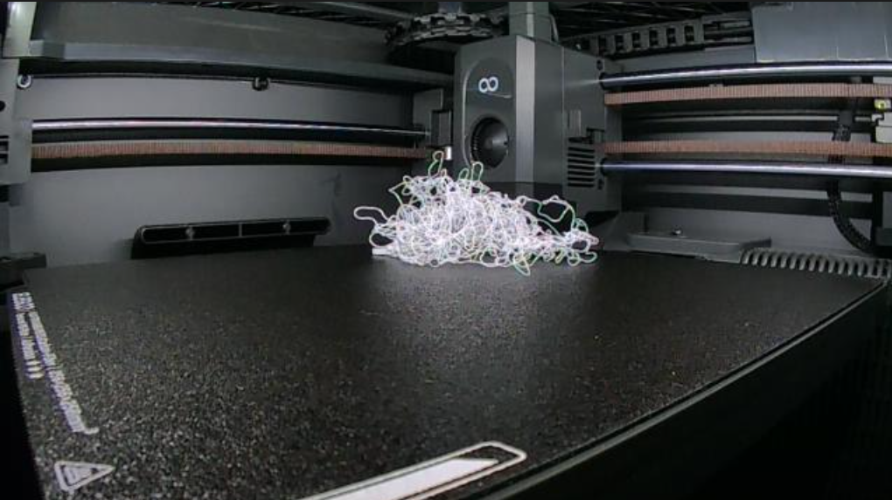

# Elegoo Spaghetti Detection

Home Assistant spaghetti/failure detection for Elegoo FDM printers. It is
tested with Elegoo Centauri Carbon 2 through
[`danielcherubini/elegoo-homeassistant`](https://github.com/danielcherubini/elegoo-homeassistant),
but the detector can use any Home Assistant camera entity.

[](https://my.home-assistant.io/redirect/hacs_repository/?owner=hepter&repository=ha-elegoo-spaghetti-detection&category=integration)

This project started as an Elegoo-focused adaptation of
[`nberktumer/ha-bambu-lab-p1-spaghetti-detection`](https://github.com/nberktumer/ha-bambu-lab-p1-spaghetti-detection).
The original project provided the Obico ML workflow and Home Assistant
integration foundation.

This repository is not affiliated with Elegoo, Home Assistant, HACS, Obico, or
the original upstream author.

## Scope

The integration detects possible print failures and exposes Home Assistant
entities/events. It does not directly control the printer.

Detection flow:

```text
camera snapshot -> ML server -> confidence/result sensors -> Home Assistant events
```

Printer-specific actions such as pause, resume, stop, and notifications belong
in user automations. Ready-to-edit examples are included.

## Features

- Works with Home Assistant camera entities, including Elegoo chamber cameras.
- Uses an Obico/TSD FDM failure model running in a local Docker/HA add-on server.
- Validates ML server health and camera image reachability during setup.
- Optional print status sensor gates scheduled detection to active print states.
- Elegoo `print_status` sensors are guarded by the companion `current_status`
  sensor when it exists, avoiding scheduled checks during homing/idle states
  where `print_status` can remain `printing`.
- Optional chamber light control can leave the light alone, turn it on and keep
  it on, or temporarily turn it on and restore the previous state after each
  snapshot.
- Manual `Test Spaghetti Detection` button.
- Confidence, raw score, detection count, status, last run, next run, and last
  error sensors.
- `binary_sensor.<prefix>_spaghetti_detected`.
- Events for every result and for detected failures.
- ML server web dashboard, JSON status, recent request logs, and image debug
  endpoint.
- CPU-first ML startup by default to avoid CUDA timeout failures on systems
  without a working GPU runtime.

## Documentation

- [Installation](docs/installation.md)
- [Configuration](docs/configuration.md)
- [Automation examples](docs/automations.md)
- [Dashboard examples](docs/dashboard.md)
- [ML server and logs](docs/ml-server.md)
- [Troubleshooting](docs/troubleshooting.md)
- [HACS publishing notes](docs/HACS_PUBLISHING.md)

## Screenshots

Integration setup:


Enhanced dashboard in idle state:



Enhanced dashboard after a detected failure:



Camera frame with an obvious spaghetti failure:



## Quick Start

1. Run the ML server. See [ML server and logs](docs/ml-server.md).
2. Install the custom integration through HACS or manually. See
   [Installation](docs/installation.md).
3. Add `Elegoo Spaghetti Detection` from Home Assistant integrations.
4. Select the camera and optional print status sensor. See
   [Configuration](docs/configuration.md).
5. Press `Test Spaghetti Detection`.
6. Add one of the [automation examples](docs/automations.md).
7. Add one of the [dashboard examples](docs/dashboard.md).

## Typical Elegoo CC2 Entities

Your entity IDs depend on the printer/device name in Home Assistant. With a
default-ish Elegoo Centauri Carbon 2 setup they often look like:

```text
camera.elegoo_centauri_carbon2_chamber_camera
sensor.elegoo_centauri_carbon2_print_status
light.elegoo_centauri_carbon2_chamber_light
button.elegoo_centauri_carbon2_pause_print
button.elegoo_centauri_carbon2_resume_print
button.elegoo_centauri_carbon2_stop_print
```

The integration setup uses only camera, optional print status, and optional
light. Pause/stop/resume are shown only in automation examples.

## Events

Every detection result fires:

```text
elegoo_spaghetti_detection_result
```

Detected failures fire:

```text
elegoo_spaghetti_detection_detected
```

When a print status sensor is configured, scheduled detected events are emitted
once per active print window. If the printer leaves the configured active states
and later returns to an active state, a new detected failure can emit one new
event.

Use this event for notification, pause, and stop automations.

`elegoo_spaghetti_detection_result` still fires for every completed check. Use
that event for logging, dashboards, or advanced automations only; notification
automations based on the result event can repeat every detection interval.

Event data includes:

```text
config_entry
detector
name
camera
manual
printer_state
confidence
raw_score
detected
detections
image_url
last_error
last_run
next_run
status
```

Use these fields in notifications and advanced automations.
