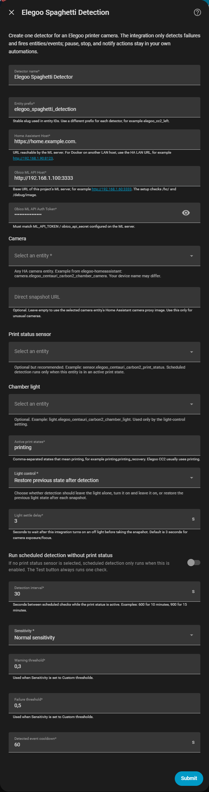

# Configuration

Open:

```text
Settings -> Devices & services -> Add integration -> Elegoo Spaghetti Detection
```



The setup form creates one detector. Add another detector for another camera.
Existing detector settings are reused as defaults to reduce repeated server
entry.

## Fields

| Field | Notes |
| --- | --- |
| `Detector name` | Display name for this camera/detector. |
| `Entity prefix` | Stable entity ID prefix, for example `elegoo_spaghetti_detection` or `elegoo_cc2_left`. |
| `Home Assistant Host` | URL reachable by the ML server. For Docker on another LAN host, prefer the HA LAN URL, for example `http://192.168.1.90:8123`. Do not use `homeassistant.local` unless the Docker host can resolve mDNS. |
| `Obico ML API Host` | Base URL of this project's ML server, for example `http://192.168.1.100:3333`. Do not enter `/hc/` or `/p/`. |
| `Obico ML API Auth Token` | Must match `ML_API_TOKEN` / `obico_api_secret` configured on the ML server. |
| `Camera` | Any HA camera entity. Example: `camera.elegoo_centauri_carbon2_chamber_camera`. Your device name may differ. |
| `Direct snapshot URL` | Optional. Leave empty to use the selected camera's HA camera proxy image. Use this only for unusual camera integrations. |
| `Print status sensor` | Optional but recommended. Example: `sensor.elegoo_centauri_carbon2_print_status`. Scheduled detection runs only when this entity is in an active print state. For Elegoo-style entity names, a matching `sensor.<printer>_current_status` is used automatically as an extra guard; you do not select it separately. |
| `Active print states` | Comma-separated states that mean printing. For Elegoo CC2, `printing` is usually enough. You can use `printing,printing_recovery`. |
| `Chamber light` | Optional. Example: `light.elegoo_centauri_carbon2_chamber_light`. |
| `Light control` | `Do not control light`, `Turn on before detection and leave on`, or `Restore previous state after detection`. Restore mode only turns the light off again when it was off before this detection cycle. |
| `Light settle delay` | Seconds to wait after the integration turns on an off light before taking the snapshot. Default is `3`; useful for camera exposure/focus. |
| `Run scheduled detection without print status` | Keep off unless this detector is camera-only and has no print status entity. |
| `Detection interval` | Seconds between scheduled checks while the print status is active. Examples: `600` for 10 minutes, `900` for 15 minutes. |
| `Sensitivity` | High, normal, low, or custom thresholds. |
| `Warning/Failure threshold` | Used when sensitivity is `Custom thresholds`. |
| `Detected event cooldown` | Minimum seconds between detected events. Default is `900` seconds. Scheduled checks with a print status sensor use the active print window limit instead, so this is mainly a fallback for camera-only setups and manual testing. |

## Print-State Guarding

The setup form asks for one status entity: `Print status sensor`.

For Elegoo printers, select the `print_status` entity:

```text
sensor.elegoo_centauri_carbon2_print_status
```

If the selected entity ends with `_print_status`, the integration automatically
checks for a sibling `_current_status` entity:

```text
sensor.elegoo_centauri_carbon2_current_status
```

There is no separate field for `current_status`. It is an automatic fallback
guard. Scheduled detection runs only when the selected `print_status` is active
and the inferred `current_status`, when present, is also active.

Example:

```text
print_status = printing
current_status = idle
result: scheduled detection does not run
```

This protects against printer/integration states where `print_status` remains
`printing` during homing, idle, or other non-print movement states.

## Repeated Notification Guarding

When a `Print status sensor` is selected, scheduled detection emits at most one
`elegoo_spaghetti_detection_detected` event while the printer remains in one of
the configured `Active print states`. If the selected status sensor or the
automatic `current_status` guard leaves the active states and later returns to
an active state, a new failure can emit one new detected event.

This is separate from the fallback guard above. The fallback guard decides
whether scheduled detection should run. The repeated-notification guard decides
whether a detected result should fire another notification/action event.

## Example Elegoo CC2 Values

These are examples from one `elegoo-homeassistant` install. Your entity IDs may
change if the Home Assistant device name differs.

```text
Entity prefix: elegoo_spaghetti_detection
Home Assistant Host: http://192.168.1.90:8123
Obico ML API Host: http://192.168.1.100:3333
Obico ML API Auth Token: obico_api_secret
Camera: camera.elegoo_centauri_carbon2_chamber_camera
Print status sensor: sensor.elegoo_centauri_carbon2_print_status
Active print states: printing
Chamber light: light.elegoo_centauri_carbon2_chamber_light
Light control: Restore previous state after detection
Light settle delay: 3
```

With restore mode, a scheduled check does this:

```text
light was off -> turn on -> wait -> snapshot/detect -> turn off
light was on  -> snapshot/detect -> keep on
```

## Created Entities

With prefix `elegoo_spaghetti_detection`, the integration creates:

```text
binary_sensor.elegoo_spaghetti_detection_spaghetti_detected
sensor.elegoo_spaghetti_detection_confidence
sensor.elegoo_spaghetti_detection_raw_score
sensor.elegoo_spaghetti_detection_detections
sensor.elegoo_spaghetti_detection_status
sensor.elegoo_spaghetti_detection_last_error
sensor.elegoo_spaghetti_detection_last_run
sensor.elegoo_spaghetti_detection_next_run
button.elegoo_spaghetti_detection_test_spaghetti_detection
button.elegoo_spaghetti_detection_reset_detection_state
```

Press `Test Spaghetti Detection` to run one check immediately from the current
camera image, even if the printer is not printing.
